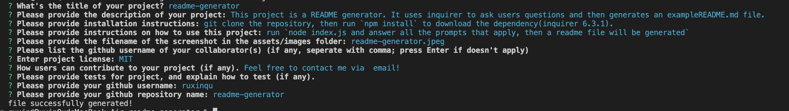

# readme-generator

## Description

This project is a README generator. It uses inquirer to ask users questions and then generates an `exampleREADME.md` file. 

## Table of Contents
- [Installation](#installation)
- [Usage](#usage)
- [License](#license)
- [Contribute](#contribute)

## Installation

git clone the repository, then run `npm install` to download the dependency(inquirer 6.3.1).

## Usage

1. Run `node index.js` when you're ready to generate a README file for your project
2. To generate a README file, the project title, description, usage(including screenshot), license, github username and repository name are required.
3. Users can provide additional information such as: installation instruction, collaborators, how to contribute and tests.
4. The license badge and link are provided.

Here's a screenshot of the project:

## License

This project is under MIT license

[https://www.gnu.org/licenses/gpl-3.0.txt](https://www.gnu.org/licenses/gpl-3.0.txt)

## Contribute
Feel free to contact me via Email: ruxinqu@gmail.com or just open an issue on my repository!